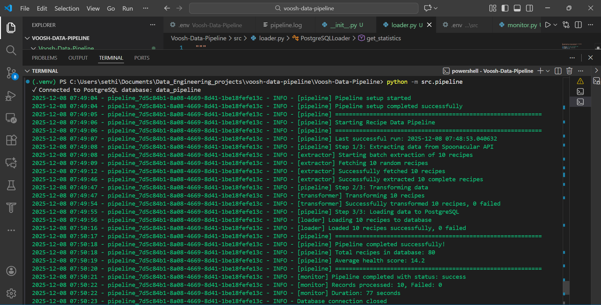
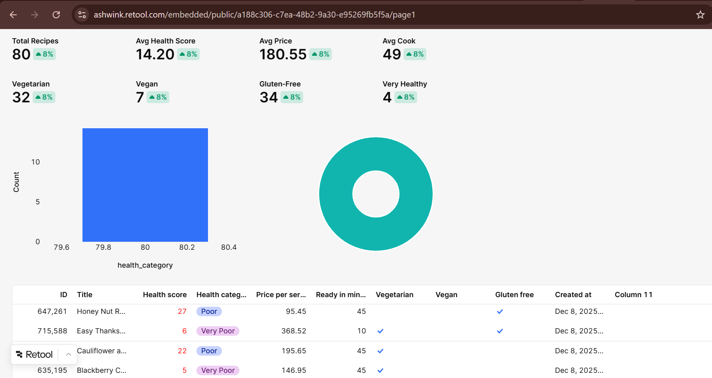
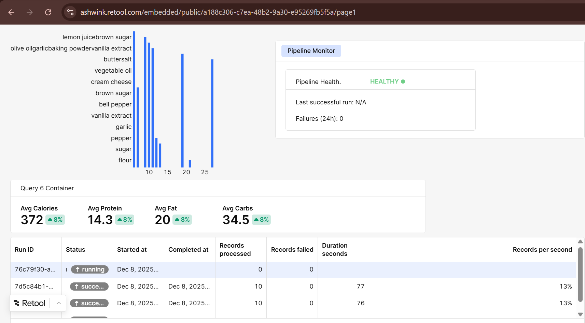
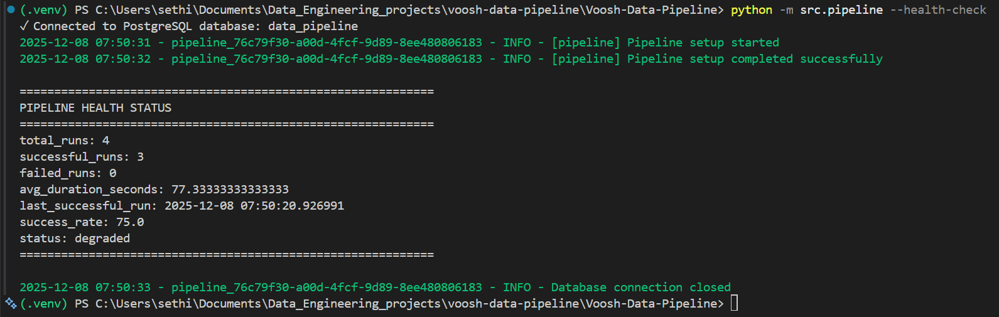
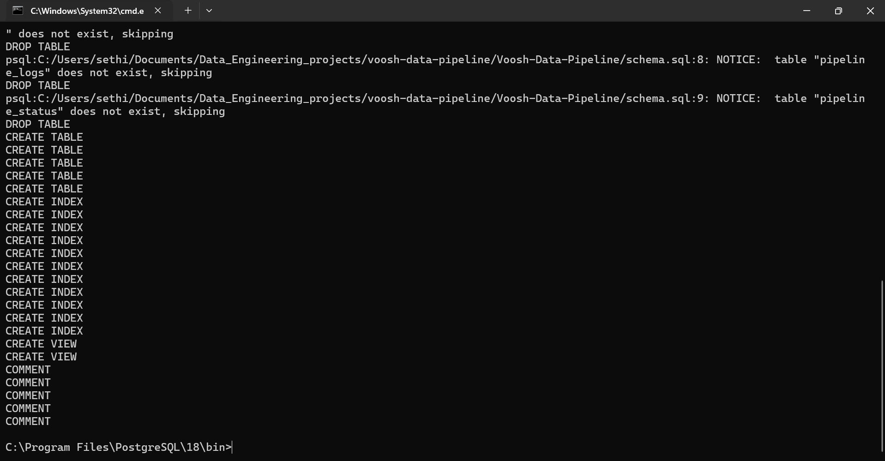
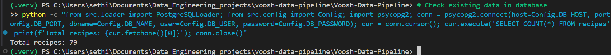
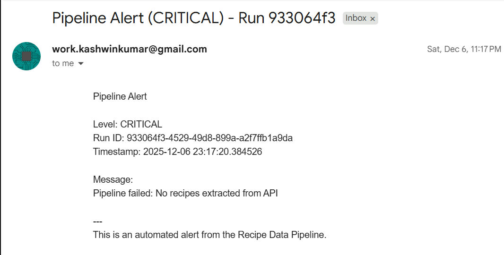

# Recipe-Data-Pipeline
  A robust end-to-end data pipeline that fetches recipe data from the Spoonacular API, transforms it into a clean format, stores it in PostgreSQL, and provides comprehensive monitoring and reliability features.

## 🎯Overview
This pipeline demonstrates best practices in data engineering, including:

  **Data Extraction**: Resilient API client with retry logic and error handling
  **Data Transformation**: Clean, normalized data with calculated fields
  **Data Storage**: PostgreSQL with optimized schema and upsert logic
  **Monitoring & Reliability**: Comprehensive logging, health tracking, and alerting
  **Dashboard**: Retool integration for data visualization and pipeline monitoring

## 🚀 Features
### Data Pipeline
 ✅ **Robust API Integration**: Spoonacular API with automatic retries and rate limiting

 ✅ **Data Transformation**:
       Normalize nested JSON to relational format
       Calculate health score categories
       Clean HTML from text fields
       Add derived metrics (price categories, cook time ranges)

✅ **Reliable Storage**:
       Upsert logic prevents duplicates
       Transaction management ensures data integrity
       Optimized indexes for query performance

### Monitoring & Reliability
 ✅ **Multi-level Logging**: Console (colored), file, and database logging
 ✅ **Pipeline Status Tracking**: Success/failure rates, execution time, record counts
 ✅ **Health Checks**: Last successful run, error rates, performance metrics
 ✅ **Alerting**: Optional Slack and email notifications for failures
 ✅ **Error Handling**: Graceful degradation, detailed error logging, retry mechanisms

### Dashboard & Visualization
 ✅ **Retool Integration**: Pre-built queries and dashboard layout
 ✅ **Key Metrics**: Recipe counts, health scores, price distribution, diet types
 ✅ **Data Exploration**: Searchable recipe table, ingredient analysis, nutrition stats
 ✅ **Pipeline Monitoring**: Execution history, error logs, health status

## Architecture
### System Architecture Diagram
```
┌─────────────────────────────────────────────────────────────────┐
│                     Recipe Data Pipeline                        │
└─────────────────────────────────────────────────────────────────┘

                       ┌─────────────────┐
                       │  Spoonacular    │
                       │      API        │
                       │  (Data Source)  │
                       └────────┬────────┘
                                │ HTTPS/JSON
                                │ Retry Logic
                                │ Rate Limiting
                                ▼
┌───────────────────────────────────────────────────────────────┐
│                    EXTRACTION LAYER                           │
│  ┌──────────────────────────────────────────────────────────┐ │
│  │  SpoonacularExtractor (src/extractor.py)                 │ │
│  │  • Fetch random recipes                                  │ │
│  │  • Enrich with detailed information                      │ │
│  │  • Handle timeouts, failures, missing fields             │ │
│  │  • Exponential backoff retry (max 3 attempts)            │ │
│  └──────────────────────────────────────────────────────────┘ │
└───────────────────────────────────────────────────────────────┘
                           │ Raw Recipe Data (JSON)
                           ▼
┌────────────────────────────────────────────────────────────────┐
│                  TRANSFORMATION LAYER                          │
│  ┌──────────────────────────────────────────────────────────┐  │
│  │  RecipeTransformer (src/transformer.py)                  │  │
│  │  • Clean HTML tags from text                             │  │
│  │  • Normalize keys and data types                         │  │
│  │  • Calculate health score categories                     │  │
│  │  • Extract ingredients and nutrition                     │  │
│  │  • Validate data quality                                 │  │
│  └──────────────────────────────────────────────────────────┘  │
└────────────────────────────────────────────────────────────────┘
                             │ Transformed Data (Relational)
                             ▼
┌────────────────────────────────────────────────────────────────┐
│                     LOADING LAYER                              │
│  ┌──────────────────────────────────────────────────────────┐  │
│  │  PostgreSQLLoader (src/loader.py)                        │  │
│  │  • Upsert recipes (prevent duplicates)                   │  │
│  │  • Insert ingredients and nutrition                      │  │
│  │  • Transaction management                                │  │
│  │  • Connection pooling                                    │  │
│  └──────────────────────────────────────────────────────────┘  │
└────────────────────────────────────────────────────────────────┘
                            │ SQL INSERT/UPDATE
                            ▼
┌───────────────────────────────────────────────────────────────┐
│                    DATA STORAGE LAYER                         │
│  ┌──────────────────────────────────────────────────────────┐ │
│  │  PostgreSQL Database (Neon.tech)                         │ │
│  │  ┌────────────────┬────────────────┬──────────────────┐  │ │
│  │  │   recipes      │  ingredients   │   nutrition      │  │ │
│  │  │   (main data)  │  (normalized)  │  (health data)   │  │ │
│  │  └────────────────┴────────────────┴──────────────────┘  │ │
│  │  ┌────────────────┬────────────────────────────────────┐ │ │
│  │  │ pipeline_logs  │    pipeline_status                 │ │ │
│  │  │ (detailed logs)│    (execution tracking)            │ │ │
│  │  └────────────────┴────────────────────────────────────┘ │ │
│  └──────────────────────────────────────────────────────────┘ │
└───────────────────────────────────────────────────────────────┘
                            │ SQL Queries
                            ▼
┌─────────────────────────────────────────────────────────────────┐
│                  VISUALIZATION LAYER                            │
│  ┌──────────────────────────────────────────────────────────┐   │
│  │  Retool Dashboard                                        │   │
│  │  • Recipe statistics and metrics                         │   │
│  │  • Health score distribution charts                      │   │
│  │  • Pipeline execution monitoring                         │   │
│  │  • Error logs and alerting                               │   │
│  │  • Real-time data refresh                                │   │
│  └──────────────────────────────────────────────────────────┘   │
└─────────────────────────────────────────────────────────────────┘

┌─────────────────────────────────────────────────────────────────┐
│                    MONITORING LAYER                             │
│  ┌──────────────────────────────────────────────────────────┐   │
│  │  PipelineMonitor (src/monitor.py)                        │   │
│  │  • Multi-level logging (console, file, database)         │   │
│  │  • Pipeline status tracking                              │   │
│  │  • Health metrics calculation                            │   │
│  │  • Alert notifications (Slack, Email)                    │   │
│  └──────────────────────────────────────────────────────────┘   │
└─────────────────────────────────────────────────────────────────┘

┌─────────────────────────────────────────────────────────────────┐
│                  ORCHESTRATION LAYER                            │
│  ┌──────────────────────────────────────────────────────────┐   │
│  │  RecipePipeline (src/pipeline.py)                        │   │
│  │  • Coordinate all components                             │   │
│  │  • Manage execution flow                                 │   │
│  │  • Handle errors gracefully                              │   │
│  │  • Provide CLI interface                                 │   │
│  └──────────────────────────────────────────────────────────┘   │
└─────────────────────────────────────────────────────────────────┘
```
### Component Interaction
```
┌──────────────┐
│   pipeline   │  Main Orchestrator
│   .py        │  • Initializes all components
└──────┬───────┘  • Manages execution flow
       │          • Handles cleanup
       │
       ├─────────────────┬─────────────────┬─────────────────┐
       │                 │                 │                 │
       ▼                 ▼                 ▼                 ▼
┌──────────┐      ┌──────────┐    ┌──────────┐      ┌──────────┐
│extractor │      │transformer│   │  loader  │      │ monitor  │
│   .py    │      │   .py    │    │   .py    │      │   .py    │
└──────────┘      └──────────┘    └──────────┘      └──────────┘
     │                  │               │                  │
     │                  │               │                  │
     ▼                  ▼               ▼                  ▼
┌──────────┐      ┌──────────┐    ┌──────────┐      ┌──────────┐
│   API    │      │  Data    │    │PostgreSQL│      │  Logs    │
│Spoonacular│     │Validation│    │ Database │      │ & Alerts │
└──────────┘      └──────────┘    └──────────┘      └──────────┘
```
## 🛠️ Technology Stack
- **Language**: Python 3.11+
- **API**: Spoonacular Recipe API
- **Database**: PostgreSQL 14+
- **Dashboard**: Retool
  **Key Libraries**:
  `requests`: API calls
  `psycopg2`: PostgreSQL driver
  `tenacity`: Retry logic
  `colorlog`: Colored logging
  `python-dotenv`: Environment management

## 📋 Prerequisites
  **Python**: 3.11 or higher
  **PostgreSQL**: 14 or higher (or Neon.tech account)
  **Spoonacular API Key**: Free tier available at [spoonacular.com/food-api](https://spoonacular.com/food-api)
  **Retool Account**: Free tier available at [retool.com](https://retool.com)

Edit `.env` with your credentials:

```env
# Spoonacular API Configuration
SPOONACULAR_API_KEY=your_api_key_here
# PostgreSQL Database Configuration (Neon.tech)
DB_HOST=your-project.neon.tech
DB_PORT=5432
DB_NAME=your_database
DB_USER=your_username
DB_PASSWORD=your_password

# Pipeline Configuration
BATCH_SIZE=10
MAX_RETRIES=3
RETRY_DELAY=2

# Logging Configuration
LOG_LEVEL=INFO
LOG_FILE=logs/pipeline.log

# Optional: Alerting Configuration
SLACK_WEBHOOK_URL=
SMTP_HOST=
SMTP_PORT=587
SMTP_USER=
SMTP_PASSWORD=
ALERT_EMAIL=
```

**Run Pipeline Command :**
```bash
python -m src.pipeline
```
**Pipeline Health Check:**
```bash
python -m src.pipeline --health-check 
```
# 🛠️ Pipeline Execution
The pipeline fetches data, transforms it, and logs the execution status.


# 📊 Project Dashboard



### Health Check Output


### Database Schema


### Check the Existing data


# 🔔 Monitoring & Alerts
Automatic alerts are sent to Slack/Email upon failure.

